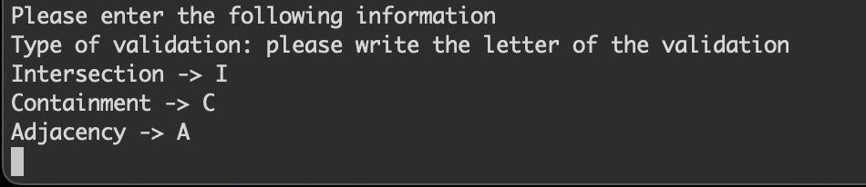
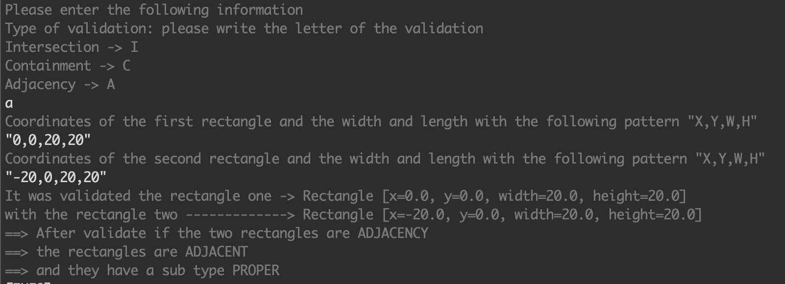
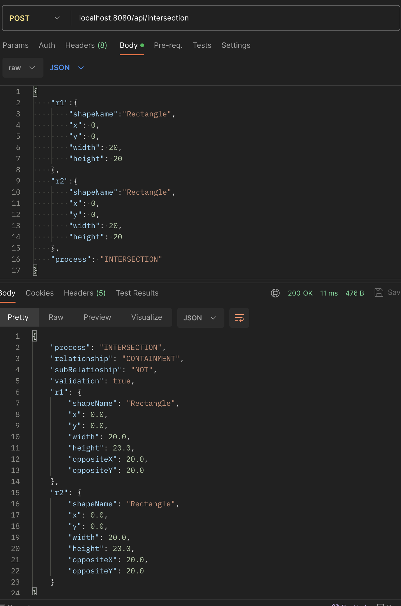

# Rectangle Application by Jherson Cohecha

## Description

This application allow validating the relationship between two rectangles, the possibles relations ship are intersecting, adjacent, or contained, The application can be used it from the terminal or as API restful

### Tools
* Spring boot
* Java 17
* lombok

## Use the application

### Console

1. clone the project https://github.com/jhecohe/Rectangles.git 
2. cd Rectangles
3. mvn spring-boot:run

To use the application we need to give the coordinates X and Y and the value for width and height

The application show us the next menu in console

* Select the case

* The application will ask the values for the two rectangles with the next format "x,y,w,h", x and y the coordinates, w to width and h to height of the rectangle.

example:

	validation -> A
	rectangle1 -> "0,0,20,20"
	rectangle2 -> "-20,0,20,20"
	

ouput

### Consume API

1. clone the project https://github.com/jhecohe/Rectangles.git 
2. cd Rectangles
3. mvn spring-boot:run -Dspring-boot.run.arguments=api

endpoints:

	localhost:8080/api/intersection
	localhost:8080/api/containment
	localhost:8080/api/adjacency
	
example:

	curl -d '{
    "r1":{
        "shapeName":"Rectangle",
        "x": 0,
        "y": 0,
        "width": 20,
        "height": 20
    },
    "r2":{
        "shapeName":"Rectangle",
        "x": -20,
        "y": 0,
        "width": 20,
        "height": 20
    },
    "process": "ADJACENCY"
		}' -H "Content-Type: application/json" -X POST localhost:8080/api/adjacency
		
Response:			

	{"process":"ADJACENCY","relationship":"ADJACENT","subRelatioship":"PROPER","validation":true,"r1":{"shapeName":"Rectangle","x":0.0,"y":0.0,"width":20.0,"height":20.0,"oppositeX":20.0,"oppositeY":20.0},"r2":{"shapeName":"Rectangle","x":-20.0,"y":0.0,"width":20.0,"height":20.0,"oppositeX":0.0,"oppositeY":20.0}}% 
	
Postman

	

